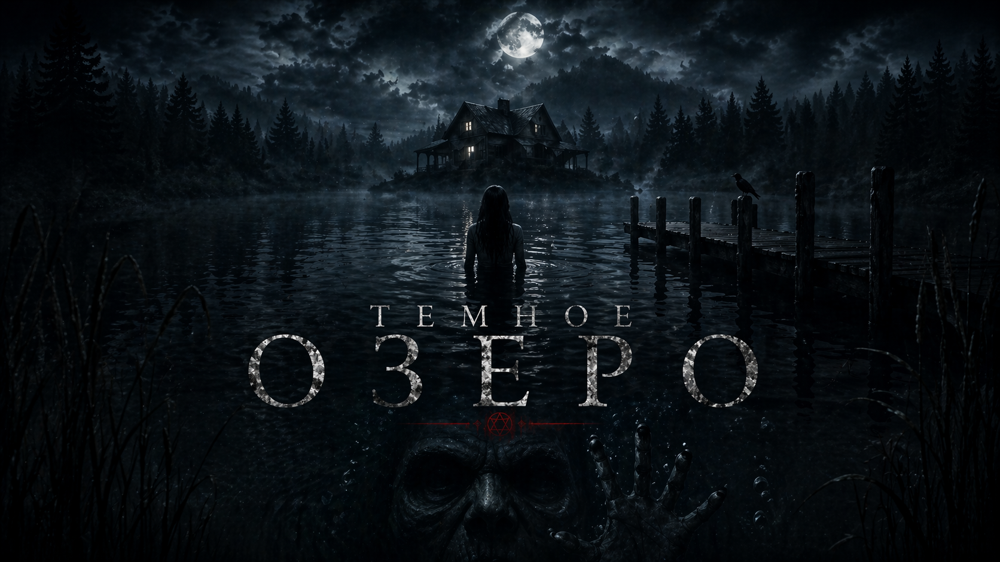

  

<h1 align="center">🌑 ТЁМНОЕ ОЗЕРО</h1>

<i>Мистический Детектив в чат-интерфейсе</i>

  
  &nbsp;
  
  &nbsp;
  

---

Однажды поздно вечером на твой телефон приходит звонок. Номер неизвестен. На другом конце — парень, который ищет пропавшую подругу. Её телефон нашли в озере два дня назад — разбитый, без батареи. А сегодня с этого телефона пришло одно слово:

> **«ПОМОГИ»**

Так начинается история, в которой ты — не герой и не наблюдатель. Ты **координатор**. Твоя роль — отвечать на сообщения, разбирать улики, принимать решения за людей, которых ты никогда не видел в лицо. Каждый выбор, каждое слово меняет их судьбу. И твою.

---

## 🌫 О чём это

Маленький северный городок **Черноводск** на берегу озера ледникового происхождения. По переписи — 1847 жителей. По слухам — каждые семь лет из города пропадают люди. Всегда у этого озера.

Она была седьмой.

Или **ты** седьмой.

Тебе предстоит связаться с её друзьями, семьёй, местными стариками и блогерами-искателями. Разобрать архив 1943 года, расшифровать обратную молитву, спуститься в тоннели под старой водонасосной станцией — чьими-то чужими глазами. Понять, что такое **«Глубинный»**. И решить, готов ли ты отдать ему то, что он хочет.

---

## 🕯 Чем это ощущается

**Это игра, где ты сидишь в телефоне.** Смотришь на чат, как в любой переписке. Ждёшь, пока собеседник напечатает. Видишь три точки. Получаешь фото. Слышишь, как приходит уведомление. Читаешь дневник 11-летней девочки. Рассматриваешь карту тоннелей 1943 года. Выбираешь ответ — и он меняет, кого ты увидишь следующим.

Почти всё происходит реальным временем. Персонажи исчезают из сети посреди разговора. Некоторые возвращаются. Некоторые — нет. Ты можешь не узнать правду. Можешь узнать слишком много.

В 2:00 ночи кто-то может написать тебе другое, чем днём. В 3:41 один из них не спит, потому что думает про неё. Если ты тоже не спишь — он это видит.

---

## 🎭 Персонажи

| | |
|---|---|
| 🧥 **Макс Волков** · 24 года | Друг детства Лизы. Едет в Черноводск первым. |
| 🌸 **Соня Белова** · 22 года | Соседка Лизы по комнате. Нашла дневник. |
| 📷 **Артём Карин** · 28 лет | Фотограф. Живёт в Черноводске. Знает озеро. |
| 🚓 **Громов** | Участковый. 40 лет в Черноводске. Не хочет говорить. |
| 👵 **Вера Ильинична** · 84 года | Старожил. Помнит 1950-е. Говорит открыто. |
| 🎥 **Кирилл Донцов** | Блогер-параноик. У него есть карта. |
| 🕯 **Виктор Морозов** · 58 лет | Отец Лизы. Нашёл твой номер в её вещах. |
| 🕴 **Александр Вяземский** | Частный детектив. Без эмоций, только факты. |
| 🌘 **Гражина** · 91 год | Шаман. Чувствует тебя через экран. |
| 👁 **???** | Неизвестный номер. |

Плюс три **групповых чата**, которые складываются по ходу расследования.

---

## 🔀 Выбор имеет значение

Игра разветвляется по-настоящему. В зависимости от того, кому ты доверяешь и чьи предупреждения слышишь, меняются:

- **Доступные сцены** — кто-то откроет правду только тому, кто его услышал
- **Судьбы персонажей** — кто-то выживет, только если ты успеешь вытащить
- **Концовка**

Всего **пять концовок**, и каждая — твоя:

- 🌅 **СПАСЕНИЕ** · Она вернулась
- 🕯 **ГЛУБИНА** · Ты пришёл к озеру
- 🌫 **ВЕЧНОСТЬ** · Дверь не открылась и не закрылась
- 👁 **СЛЕДУЮЩИЙ** · Ты стал дверью
- 🗝 **СТРАЖ** · Секретная. Найди сам.

В каждой — **именной эпилог**: кто живёт, кто молчит в трубку, кто пишет тебе первым. Зависит от тебя.

---

## ❤ Если повезёт

Если ты будешь слушать так, как никто их до этого не слушал, один из них может начать писать тебе в 3 ночи просто так. Признаваться в мелочах. Искать причину не прощаться. За три недели через экран — возможно многое.

Перед финалом у тебя будет последний разговор. Не о расследовании.

---

## 📋 Что ещё внутри

- **Доска расследования** — жизнь пропавшей по годам (6, 11, 14, 18, 21, 24), раскрывается по мере сбора улик
- **Галерея** — все фотографии, что тебе прислали, в одном месте
- **Карта Черноводска** — обитаемые точки, озеро, станция, тоннели
- **Архив** — газетные вырезки, слухи, старые истории
- **Фоновая музыка** — у каждой главы своя атмосфера
- **Режим повтора** — когда захочешь собрать все пять концовок, пропускай сцены, которые уже видел

---

## 📱 Как играть

Открой игру в браузере — всё работает прямо там. Или **установи на телефон** кнопкой «Установить» на начальном экране — игра превратится в полноценное приложение, с иконкой на рабочем столе, офлайн-доступом и без адресной строки.

Рекомендуется вертикальный экран и наушники.

---

## ⏱ Время прохождения

- **Одно прохождение:** 2.5–3 часа
- **Все пять концовок:** 6–8 часов (режим повтора сокращает время)

---

## ⚠ Не читай и не играй

- Если тебе меньше 16
- Если ты чувствителен к темам исчезновения, утопления, эху и снам
- Если ты один в пустом доме и рядом есть Озеро

---

## 🪐 Автор

**LORDEL** · 2026

Связь: [@LORD_ELSHAD](https://t.me/LORD_ELSHAD)

---

*Не смотри долго ночью на озеро.*
